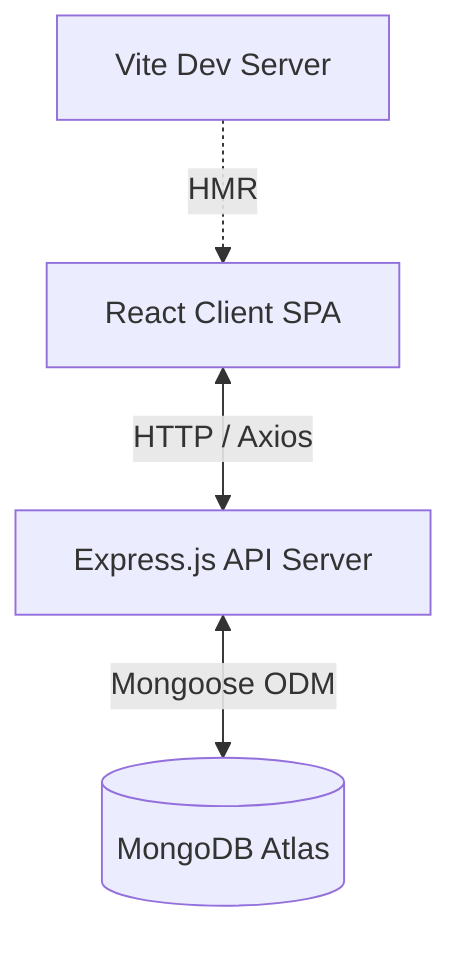
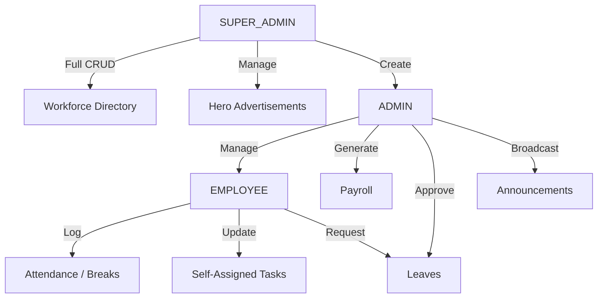
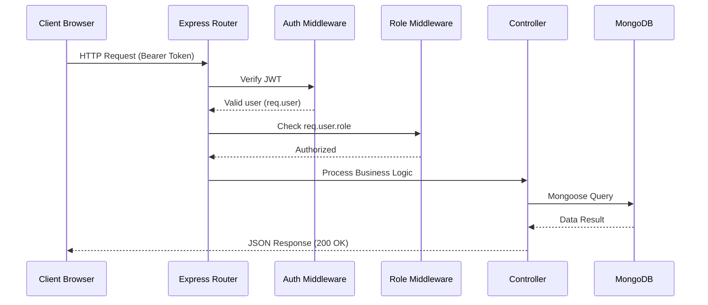
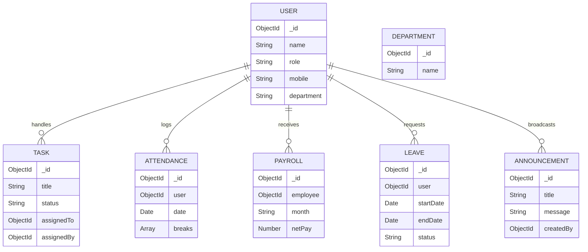
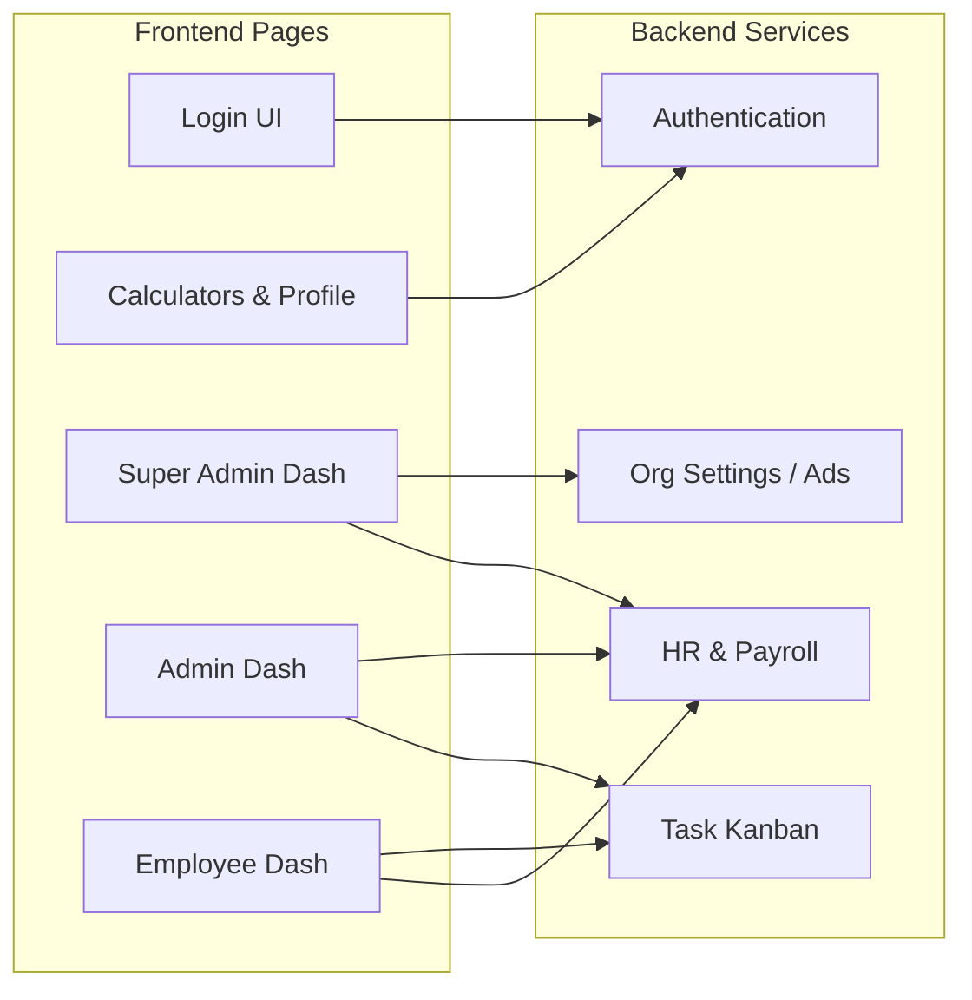

# Debor Enterprise - Workforce & Task Governance System

Debor Enterprise is a comprehensive, scalable, and secure workforce management, payroll, and task governance platform designed for role-based internal organizational operations. 

## Overview
This system provides an end-to-end Enterprise Resource Planning (ERP) and HR suite allowing strict hierarchical management of staff, their attendance, tasks, leaves, and payroll. The platform enforces stringent Data Isolation through Role-Based Access Control (RBAC), ensuring data integrity and organizational security across Super Admins, Admins, and standard Employees.

## Key Features
- **Hierarchical Dashboard System**: Distinct, tailored KPI dashboards for Super Admins, Admins, and Employees.
- **Advanced Authentication**: JWT-based secure sessions, `bcrypt` password hashing, and integrated OTP flows.
- **Workforce Directory**: Centralized CRUD management for all employee and admin profiles, complete with departmental categorization and avatar uploads.
- **Live Attendance Tracking**: Real-time punch-in, punch-out, and categorized break tracking (e.g., Lunch, Short Break).
- **Task Kanban**: Granular task assignment, lifecycle tracking, and status progression mapped to users.
- **Payroll & Leaves Management**: Secure ledger creation for basic pay, HRA, PF, PT, and Net Duty mathematical calculations. Integrated leave request and approval workflows.
- **Organizational Showcases & Bullion**: Centralized "Executive Hero Banner" management and live Bullion/Metal rate broadcasting.
- **Jewelry Calculator**: Integrated dynamic mathematical module for calculating metal weight, making charges (flat, percentage, per gram), extra charges, and GST.

## User Roles & Permissions
1. **SUPER_ADMIN**: Absolute system control. Can access the global Workforce Directory, create/edit Admins, manage Departments, and update the global Showcase/Hero Banners.
2. **ADMIN**: Middle-tier management. Can manage standard Employees, assign Tasks, approve Leaves, generate Payrolls, broadcast Announcements, and update live Bullion Rates. Cannot modify Super Admin data.
3. **EMPLOYEE**: Restricted access. Can punch in/out of attendance, apply for leaves, view their own payroll slips, view broadcast announcements, and update the statuses of tasks explicitly assigned to them. 

## Technology Stack
- **Frontend**: React 19, Vite, React Router DOM, Tailwind CSS (v4), Lucide React (Icons).
- **Backend**: Node.js, Express.js.
- **Database**: MongoDB (Object modeling via Mongoose).
- **Authentication**: JSON Web Tokens (JWT), bcryptjs (Password Hashing).
- **External Integrations**: Cloudinary (Image Hosting), MSG91 (SMS OTP Integration).
- **File Uploads**: Multer (Memory Storage) streaming directly to Cloudinary.
- **HTTP Client**: Axios (Frontend-to-Backend integration).

## Folder Structure
```
/
└── main/
    ├── backend/
    │   ├── controllers/      # Business logic (auth, payroll, tasks, attendance, etc.)
    │   ├── middleware/       # JWT Auth verification, RBAC authorization, Multer
    │   ├── models/           # Mongoose schemas (User, Task, Payroll, Attendance, etc.)
    │   ├── routes/           # Express REST API route definitions
    │   └── server.js         # Backend entry point and DB connection
    └── frontend/
        ├── src/
        │   ├── api/          # Axios service layer
        │   ├── components/   # Shared UI components (Calculators, Modals, SharedTop)
        │   ├── context/      # React Context (AuthContext)
        │   ├── pages/        # Role-based route pages (SuperAdmin, Admin, Employee, Shared)
        │   ├── App.jsx       # React Router definitions
        │   └── main.jsx      # React DOM entry point
        ├── package.json
        └── tailwind.config.js
```

## Application Modules
- **Authentication Module**: Facilitates user logins, validates sessions, and generates JWTs.
- **Workforce & Department Module**: Allows Super Admins to define organizational structures and manage all user accounts.
- **Tasks Module**: A project management interface for assigning issues, story points, and tracking completion statuses.
- **Attendance & Leaves Module**: Calculates gross duty duration versus active idle/break times. Maps leave requests to administrative approvals.
- **Payroll Module**: Financial ledger calculating gross earnings against deductions (PT, PF/TDS) using strictly validated non-negative numbers.
- **Advertisement/Showcase Module**: Manages the rotating hero banners on the shared dashboards.

## Authentication & Authorization
The application uses stateful stateless JWT architecture. 
1. Client submits credentials to `/api/auth/login`.
2. Backend verifies `bcrypt` hash and signs a JWT containing the user's `_id` and `role`.
3. Client stores the token locally and attaches it as a `Bearer` token in the `Authorization` header for all subsequent API calls.
4. Backend `authenticate` middleware decodes the token; `authorize('ROLE')` middleware explicitly blocks unauthorized access attempts.

## Database Architecture
Built on MongoDB using Mongoose schemas.
- **User**: Stores credentials, hierarchical `role`, `department` reference, and profile metadata.
- **Task**: Stores `title`, `status`, `assignedTo` (ref User), and `assignedBy`.
- **Attendance**: Stores daily punch records, active break arrays, and duration calculations.
- **Leave**: Stores date ranges, reasons, and approval `status`.
- **Payroll**: Stores financial data (`month`, `basic`, `hra`, `netPay`) linked to a specific user.
- **Advertisement/Announcement/Rate**: Stores global configuration variables for the dashboard.

## API Architecture
The RESTful API is structured logically in `main/backend/routes/route.js`.
- **Auth**: `POST /auth/login`, `POST /auth/send-otp`
- **Users/Workforce**: `GET /workforce`, `POST /workforce`, `PUT /users/:id` (Protected by `SUPER_ADMIN`/`ADMIN` constraints)
- **Tasks**: `GET /tasks`, `POST /tasks`, `PUT /tasks/:id`
- **Attendance**: `POST /attendance/clock-in`, `POST /attendance/break/start`
- **Payroll**: `POST /payroll`, `GET /payroll` (Secured financial routes)

## Major Business Workflows
1. **The Daily Lifecycle**: An Employee logs in -> Submits a Clock-In -> Updates assigned Tasks -> Initiates a Lunch Break -> Clocks Out. 
2. **The Administrative Lifecycle**: Admin logs in -> Reviews daily Employee attendance -> Approves pending Leave requests -> Generates monthly Payroll -> Broadcasts an organizational Announcement.
3. **The Executive Lifecycle**: Super Admin logs in -> Manages global department categories -> Recruits/creates new Admin accounts in the Workforce Directory -> Updates the global Dashboard Showcase banners.

## Validation & Security
- **Strict Password Requirements**: Minimum 6-character length enforced at the controller level.
- **Numeric Boundary Enforcement**: Payroll inputs enforce strict `value >= 0` boundary checks, rejecting negative injections with `400 Bad Request`.
- **Data Isolation**: Controllers implicitly bind queries (e.g., `req.user._id`) to prevent users from accessing cross-tenant or peer data.
- **Role Validation**: Middleware explicitly drops requests if the decoded JWT role does not map to the required access array.

## Setup & Installation
1. Clone the repository to your local environment.
2. Navigate to `/main/backend` and run `npm install`.
3. Create a `.env` file in the `/main/backend` directory matching the required variables below.
4. Start the backend server: `npm run server` (runs on Port 5000).
5. Navigate to `/main/frontend` and run `npm install`.
6. Start the Vite development server: `npm run dev` (runs on Port 5173/5175).

### Environment Variables (Backend)
```env
PORT=
MONGO_URI=
JWT_SECRET=
JWT_EXPIRES_IN=
MSG91_AUTH_KEY=
MSG91_TEMPLATE_ID=
MSG91_SENDER_ID=
CLOUDINARY_CLOUD_NAME=
CLOUDINARY_API_KEY=
CLOUDINARY_API_SECRET=
```

### Environment Variables (Frontend)
```env
VITE_API_URL=
```

---

## SYSTEM ARCHITECTURE

### High-Level Architecture


### Role / Access Architecture


### Request / API Architecture


### Database Relationship Architecture


### Module Architecture

